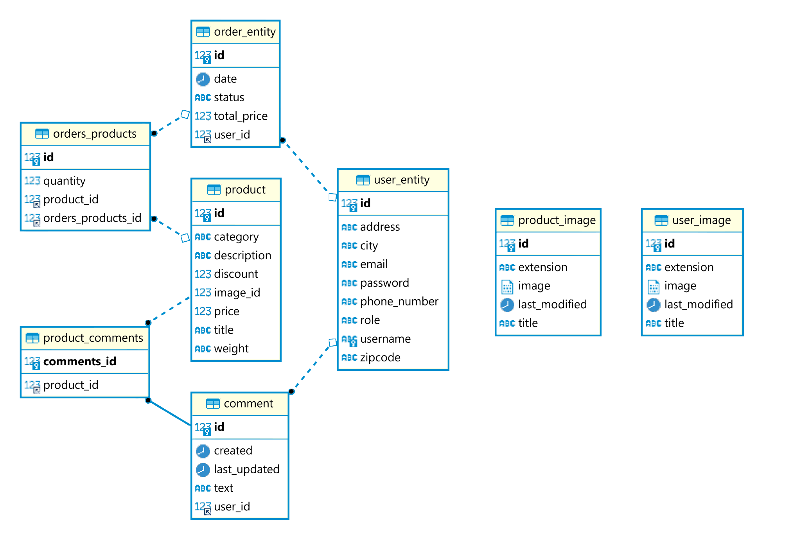

# Urban Infusion server, group 7

This repository contains the backend made for the Application Development (IDATA2306) project.

### Built With
* [Kotlin](https://kotlinlang.org) - A modern language that supports both object-oriented and functional paradigms.
* [Spring Boot](https://spring.io/projects/spring-boot) - Server framework used to build the REST API.
* [Docker](https://www.docker.com) - Used to containerize the app.
* [MySQL](https://www.mysql.com) - For the persistent database.
* [Apache Derby](https://db.apache.org/derby/) - Used for the embedded database.
* [HTTPS](https://www.rfc-editor.org/rfc/pdfrfc/rfc8446.txt.pdf) - Used for communications security in production.
* [JWT](https://github.com/jwtk/jjwt) - As the authentication mechanism.

## Getting Started

To get a local copy up and running follow these simple steps.

### Prerequisites

This is a list of things you need in order to use this application.

* **IntelliJ IDEA 2022.1.0 or newer**, necessary as Kotlin is bundled in the IDE, not needed if building directly with Maven
* **JDK 17 or newer**, always needed
* Docker is not needed
* A database installation is not needed, the server can run in embedded mode with the Apache Derby database

#### Downloading the project

**Via HTTPS:**
```sh
git clone https://gitlab.com/web-development-group7/server.git
```
**Via SSH:**
```sh
git clone git@gitlab.com:web-development-group7/server.git
```
or download it directly as a zip from [here](https://gitlab.com/web-development-group7/server/-/archive/main/server-main.zip).

### Install methods

#### GitLab Releases [Recommended]

1. Download the latest build from this repository's ["Releases" page](https://gitlab.com/web-development-group7/server/-/releases)
2. Run the downloaded `.jar` with the CMD using the `java -jar nameOfTheJarFile.jar` command.
3. The server should then start with an embedded database and be available at [http://localhost:8080](http://localhost:8080) <br>
   This is the preferred method.

### Other installation methods

#### Via IntelliJ

1. Make sure you have installed the correct version of IntelliJ as specified in the ["Prerequisites"](#prerequisites) section.
2. Download and the extract zip-file **or** clone project to the desired location as specified in the ["Downloading the project"](#downloading-the-project) section.
3. Open the `pom.xml` file with IntelliJ.
4. In IntelliJ, launch the `Application` class located in the `no.ntnu.webdev.webproject7` package.
5. The server should then start with an embedded database and be available at [http://localhost:8080](http://localhost:8080)
   <br>
   Options in other IDEs may vary.

#### Via Maven in any IDE

1. Clone **or** download the repo as a zip as specified in the ["Downloading the project"](#downloading-the-project) section.
2. Run `mvn package` in the project folder with an IDE of your choice.
3. Navigate to the `/target` folder and launch the generated `.jar` with the CMD.
4. The server should then start with an embedded database and be available at [http://localhost:8080](http://localhost:8080)

## Project structure

```
webproject7
├───configs
├───controllers
├───dto
├───exceptions
├───models
├───repositories
├───security
├───serializers
├───services
└───utilities
```

We have tried to keep the project organized by categorizing classes into packages by their respective domains. 

#### Configs
Contains the different configurations, for ex. cors and security configs

#### Controllers
Houses the controller classes that provide the REST endpoints for the app

#### DTO
Contains all the different DTOs (Data Transfer Objects)

#### Exceptions
Contains the different exceptions that are used to signal errors

#### Repositories
Contains the repository classes tasked with connecting to the DB

#### Security
The JWT implementation

#### Serializers
Houses the custom JSON deserializers that translate strings to enum types

#### Services
Contains all the service classes that house the business logic

#### Utilities
Contains mostly static functions that are used throughout the app 

## Database schema

The following is our database schema:



## Project requirements

The application has two main roles:
1. Admin
2. User

An admin can do everything that a user can but admins can access extra functionality that is not available to users.

A user can:

* [x] Signup and log in
* [x] View products
* [x] Send in an order
* [x] Write a comment for a product
* [x] Edit their own comment
* [x] See other user's comments

An admin can:

* [x] Add a new product
* [x] Update a product
* [x] Delete a product
* [x] See all user orders
* [x] Mark an order as processed
* [x] See all user comments for each product
* [x] Delete any user comment

Our app currently has a predefined admin user and a regular user used under testing:

_Admin:_
* username: admin
* password: admin

_User:_
* username: user
* password: user

Note: These predefined users are **only** meant to be used for demo and development purposes, they should not be included in a real scenario.

## Disclaimers

* All product images used were fetched from [pngegg.com](https://www.pngegg.com) and are covered by their _non-commercial use only_ license.
* The user images used in this project have been generated by an AI and do not depict any person currently alive or dead.
